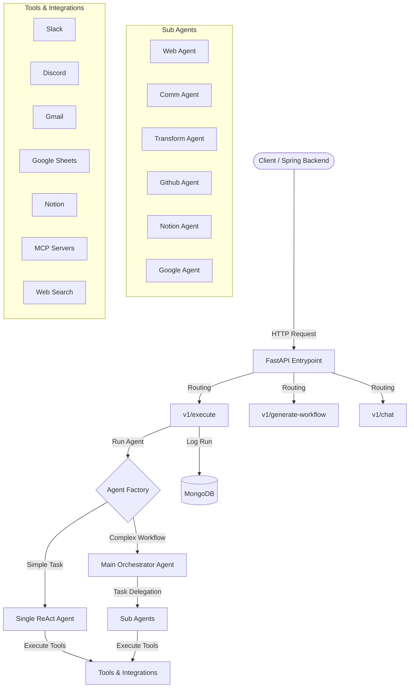
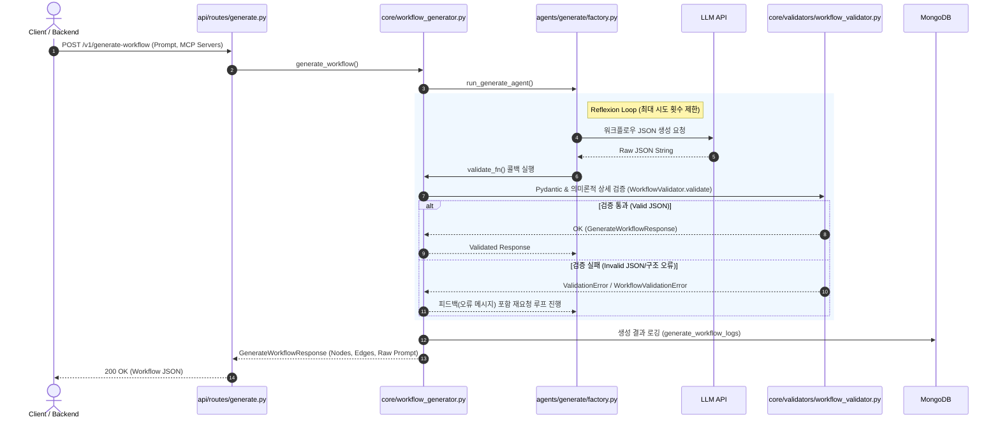
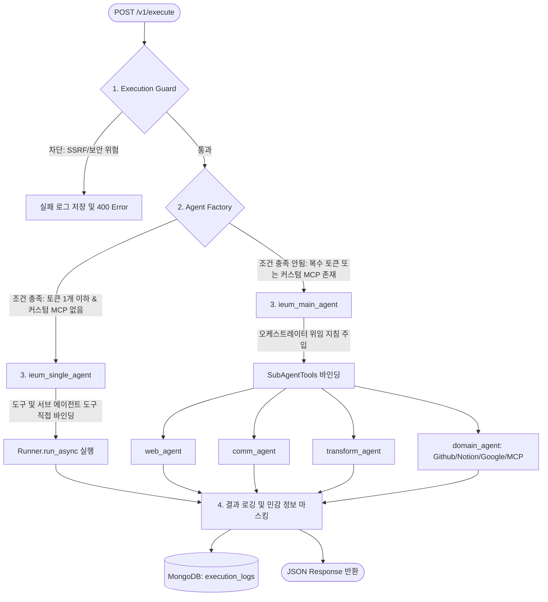

# ieum-agent (이음 에이전트)

IEUM(이음) 워크플로우 플랫폼의 **AI 노드 실행** 및 **동적 워크플로우 제어**를 전담하는 FastAPI 기반의 AI 에이전트 서비스입니다. 
Google ADK(Agent Development Kit)와 MongoDB를 활용하여 멀티 에이전트 오케스트레이션 및 다양한 서브 에이전트 연동을 수행합니다.

---

## Tech Stack

- **Framework:** FastAPI
- **AI Agent Engine:** Google ADK (Agent Development Kit)
- **Database:** MongoDB (Motor - Async Driver)
- **Supported AI Providers:** Gemini, OpenAI, Claude
- **Language:** Python 3.11+

---

## System Architecture & Workflow

이음 에이전트는 다양한 서브 에이전트와 도구를 결합하여 동작합니다.



---

## Workflow Lifecycle (Generation & Execution Flow)

이음 에이전트 서비스가 워크플로우를 생성(Generation)하고 실행(Execution)하는 전체 파이프라인의 상세 라이프사이클입니다.

### 1. 워크플로우 생성 프로세스 (Workflow Generation Flow)

사용자가 자연어로 자동화하고자 하는 파이프라인을 묘사하면, 내부적으로 generate_workflow는 다음과 같은 밸리데이션 루프를 통해 스키마에 안전한 형태의 워크플로우 JSON을 생성합니다.



### 2. 워크플로우 실행 프로세스 (Workflow Execution Flow)

각 워크플로우의 AI 노드들은 다음과 같이 단일 최적화(ReAct) 또는 오케스트레이터 기반 멀티에이전트 방식으로 처리 및 실행됩니다.



---

## Key Features & Endpoints

### 1. AI Node Execution (`POST /v1/execute`)
- Spring Boot 백엔드에서 AI 노드를 실행할 때 호출됩니다.
- 입력된 렌더링된 프롬프트와 연결된 도구를 기반으로 에이전트가 동작합니다.
- 멀티 에이전트 모드와 Latency가 최적화된 단일 ReAct 에이전트 모드를 지원합니다.

### 2. Workflow Generation (`POST /v1/generate-workflow`)
- 자연어로 전달된 사용자 요구사항을 분석하여, 적절한 Node와 Edge를 갖춘 이음 워크플로우 규격을 자동으로 설계 및 생성합니다.

### 3. Interactive Chat (`POST /v1/chat`)
- 사용자와 대화를 나누며 워크플로우를 점진적으로 설계·수정하고, 필요한 외부 연동 상태를 진단 및 설정합니다.

---

## API Authentication Headers

이음 에이전트는 API 호출 시 다음과 같은 보안 및 모델 식별용 헤더를 필요로 합니다:

| Header Name | Type | Description | Example |
| :--- | :---: | :--- | :--- |
| `X-LLM-Provider` | `string` | 사용할 AI 공급자 (gemini, openai, claude) | `gemini` |
| `X-LLM-Api-Key` | `string` | 선택한 공급자의 API Key | `AIzaSy...` |
| `X-LLM-User-Id` | `string` | 호출하는 사용자의 고유 ID | `user_12345` |
| `X-LLM-Google-Access-Token` | `string` | (선택) Google 연동 도구용 Access Token | `ya29...` |
| `X-LLM-Notion-Token` | `string` | (선택) Notion 연동용 API Key / OAuth Token | `secret_...` |
| `X-LLM-Github-Token` | `string` | (선택) Github 연동용 Personal Access Token | `ghp_...` |

---

## Local Execution Guide

### 1. 환경 변수 복사 및 설정
```bash
cp .env.example .env
```
`.env` 파일에 MongoDB 연결 정보 및 사용할 기본 모델명을 입력합니다.

### 2. 가상환경 구축 및 패키지 설치
```bash
python -m venv .venv
source .venv/bin/activate
pip install -r requirements.txt
```

### 3. 애플리케이션 실행
```bash
uvicorn main:app --reload
```

---

## Testing

이 프로젝트는 pytest 및 AsyncClient를 사용하여 비동기 엔드포인트와 에이전트 흐름을 검증합니다.

```bash
# 전체 테스트 실행
pytest

# 상세 정보 출력하며 테스트 실행
pytest -v

# 특정 파일 테스트 실행
pytest tests/test_execute.py
```

---

## Deep Dives & Guides

자세한 설계 및 아키텍처 가이드는 아래 문서를 참고하십시오:
- [아키텍처 및 핵심 설계 결정](docs/claude/architecture.md)
- [신규 도구(Tool) 추가 가이드](docs/claude/tools-guide.md)
- [신규 AI 공급자(Provider) 추가 가이드](docs/claude/providers-guide.md)
- [테스트 작성 패턴 및 실행 가이드](docs/claude/testing-guide.md)